<div align="center">

# 💳 Credit Risk Assessment & Explainability Engine
### Production-Grade MLOps Pipeline with XGBoost, SHAP, MLflow, Evidently AI, Docker & AWS

[](https://www.python.org/)
[](https://fastapi.tiangolo.com/)
[](https://xgboost.readthedocs.io/)
[](https://shap.readthedocs.io/)
[](https://mlflow.org/)
[](https://www.evidentlyai.com/)
[](https://www.docker.com/)
[](https://aws.amazon.com/ec2/)
[](https://github.com/features/actions)

<p align="center">
  <b>An end-to-end Machine Learning system that predicts loan default probabilities, calibrates risk scores, computes real-time regulatory adverse action explanations via SHAP, and continuously monitors production data drift with Evidently AI.</b>
</p>

[Key Features](#-key-features) •
[Architecture](#-system-architecture) •
[Machine Learning Pipeline](#-machine-learning--modeling) •
[MLOps & Monitoring](#-mlops-stack--monitoring) •
[API Reference](#-api-reference) •
[Quickstart](#-quickstart-guide) •
[AWS Deployment](#-aws-ec2-deployment)

</div>

---

## 📌 Executive Summary

Credit risk assessment is the cornerstone of commercial and retail lending. Incorrect default predictions create significant financial risk:
- **False Negatives (Approving a default-prone applicant):** Incurs direct capital loss of the loan principal.
- **False Positives (Denying a creditworthy applicant):** Results in customer churn and forfeited interest revenue.
- **Regulatory Scrutiny:** Regulations such as the **U.S. Equal Credit Opportunity Act (ECOA)** and the **Fair Credit Reporting Act (FCRA)** strictly mandate that lenders provide verifiable, transparent reasons (**Adverse Action Notices**) when credit is declined or modified.

This project delivers an end-to-end, production-ready solution that combines **cost-sensitive machine learning**, **probability calibration**, **real-time explainability (XAI)**, and **continuous MLOps monitoring** deployed via Docker and AWS.

---

## ✨ Key Features

- **Extreme Gradient Boosting (XGBoost):** Trained on 32,000+ consumer loan applications with stratified k-fold cross-validation and imbalance compensation (`scale_pos_weight = 3.63`).
- **Platt Probability Calibration (`CalibratedClassifierCV`):** Transforms raw tree outputs into true, well-calibrated posterior probabilities, ensuring scores reflect actual default frequencies (Brier Score: `0.0527`).
- **Cost-Sensitive Optimal Decision Threshold:** Dynamically computes optimal threshold (`0.7204`) balancing precision, recall, and financial cost matrices.
- **Real-Time SHAP Explainability:** Exposes an `/explain` endpoint that extracts instant applicant-level feature attributions (top risk-increasing and mitigating drivers) for regulatory compliance.
- **Evidently AI Production Monitoring:** Automatically logs all production inference events into SQLite and generates interactive data drift and data quality reports comparing live traffic against training distributions.
- **MLflow Experiment Tracking:** Automatically logs hyperparameters, ROC-AUC, Brier score, calibration curves, confusion matrices, and model binaries to a centralized registry (`sqlite:///mlflow.db`).
- **Automated CI/CD with GitHub Actions:** Executes 10 unit and API integration tests on every push, builds multi-stage Docker images, and automatically deploys to AWS EC2 via SSH.
- **Responsive Underwriting Interface:** Custom-styled financial ledger UI with animated probability gauges, risk stamps, and local SHAP factor visualizers.

---

## 🏛 System Architecture

```mermaid
flowchart TD
    subgraph DataOps["1. Data Engineering & Preprocessing"]
        A["Raw Data (credit_risk_dataset.csv)"] --> B["Data Loader & Cleaning (src/data_loader.py)"]
        B --> C["Outlier Removal & Stratified Split"]
        C --> D["ColumnTransformer: Median Impute + One-Hot Encoding"]
    end

    subgraph ModelOps["2. Model Training & MLflow Tracking"]
        D --> E["XGBoost Classifier (scale_pos_weight=3.63)"]
        E --> F["Platt Scaling (CalibratedClassifierCV)"]
        F --> G["Threshold Optimizer (F1 & Cost Sensitive)"]
        G --> H["TreeExplainer Persistence (SHAP)"]
        E & F & G & H --> I[("MLflow Tracking DB (mlflow.db)")]
        I --> J["Saved Artifacts (credit_risk_model.pkl, best_threshold.pkl)"]
    end

    subgraph ServingLayer["3. Serving & Explainability (FastAPI)"]
        J --> K["FastAPI Service (main.py)"]
        K --> L["POST /predict (Calibrated Probability)"]
        K --> M["POST /explain (Local SHAP Feature Drivers)"]
        K --> N["Interactive Web UI (static/)"]
    end

    subgraph MLOpsLayer["4. Production Monitoring & Observability"]
        L --> O[("Inference DB (data/inferences.db)")]
        O --> P["Evidently AI Drift Engine (src/monitoring.py)"]
        P --> Q["Interactive Drift Report (GET /monitoring/report)"]
        P --> R["Drift Status API (GET /monitoring/status)"]
    end

    subgraph CICD["5. Automated CI/CD & Cloud Deployment"]
        S["GitHub Push to main"] --> T["GitHub Actions CI (pytest tests/)"]
        T --> U["Build Docker Image & Push to GHCR / Docker Hub"]
        U --> V["SSH Deploy to AWS EC2 (Docker Compose)"]
    end
```



---

## 🔬 Machine Learning & Modeling

### 1. Data Cleaning & Feature Engineering
- **Outlier Sanitation:** Filtered unrealistic applicant ages (`18 <= person_age <= 100`), employment lengths exceeding applicant age (`person_emp_length <= person_age`), and non-positive loan amounts.
- **Preprocessing Pipeline ([src/preprocessing.py](src/preprocessing.py)):**
  - **Numerical Features (7):** `person_age`, `person_income`, `person_emp_length`, `loan_amnt`, `loan_int_rate`, `loan_percent_income`, `cb_person_cred_hist_length` ➔ Imputed with median.
  - **Categorical Features (4):** `person_home_ownership`, `loan_intent`, `loan_grade`, `cb_person_default_on_file` ➔ Imputed with constant `"Missing"` + One-Hot Encoded with `handle_unknown="ignore"`.

### 2. Model Performance Comparison

| Model | Calibration | ROC-AUC | PR-AUC | Brier Score | Optimal F1 | Precision | Recall |
| :--- | :---: | :---: | :---: | :---: | :---: | :---: | :---: |
| **Baseline Logistic Regression** | No | 0.8650 | 0.7120 | 0.0980 | 0.6920 | 0.7410 | 0.6500 |
| **Baseline XGBoost** | No | 0.9480 | 0.8950 | 0.0610 | 0.8120 | 0.9230 | 0.7250 |
| **Calibrated XGBoost (Production)** | **Yes (Sigmoid, 5-Fold)** | **0.9520** | **0.9080** | **0.0527** | **0.8408** | **0.9758** | **0.7386** |

> **Brier Score:** Lower is better (0 = perfect calibration). At `0.0527`, the predicted probabilities reflect actual empirical default frequencies.

### 3. Explainable AI (SHAP TreeExplainer)
Instead of treating XGBoost as a black box, the system extracts the underlying gradient boosted decision trees into a `shap.TreeExplainer`. On every application, the model computes exact Shapley feature attributions:
- **Risk-Increasing Factors (Red):** Factors pushing the applicant towards default (e.g., high `loan_percent_income`, high `loan_int_rate`, `loan_intent_VENTURE`).
- **Risk-Mitigating Factors (Green):** Factors lowering default risk (e.g., high `person_income`, longer `person_emp_length`, home ownership `MORTGAGE`).

---

## 🛠 MLOps Stack & Monitoring

### 1. Experiment Tracking with MLflow
- Backed by an SQLite store (`sqlite:///mlflow.db`).
- Tracks parameters, metrics, model binaries, calibration diagrams, and ROC curves for every retraining run.
- Launch the UI:
  ```bash
  mlflow ui --backend-store-uri sqlite:///mlflow.db --port 5000
  ```

### 2. Live Drift & Data Quality Monitoring with Evidently AI
- All inference requests to `/predict` are logged into SQLite asynchronously (`data/inferences.db`).
- **Statistical Tests:** Evaluates Kolmogorov-Smirnov and Wasserstein distance tests on feature columns against reference training data.
- **Live Dashboards:**
  - View interactive dashboard: `GET /monitoring/report`
  - Get JSON summary: `GET /monitoring/status`
  - Trigger manual recalculation: `POST /monitoring/run`

### 3. Automated Test Suite (10 Tests Passing)
- **Data Tests ([tests/test_data.py](tests/test_data.py)):** Schema validation, cleaning boundaries, and stratified split checks.
- **Pipeline Tests ([tests/test_pipeline.py](tests/test_pipeline.py)):** Preprocessing integrity, threshold validity, metric computation.
- **API Tests ([tests/test_api.py](tests/test_api.py)):** OpenAPI contracts, `/predict`, `/explain`, and `/monitoring/status`.

---

## 🔌 API Reference

### 1. `POST /predict`
Evaluates applicant features and returns calibrated default probability, binary risk classification, and optimal threshold.

**Request:**
```json
{
  "person_age": 28,
  "person_income": 65000.0,
  "person_home_ownership": "RENT",
  "person_emp_length": 4.0,
  "loan_intent": "EDUCATION",
  "loan_grade": "A",
  "loan_amnt": 8000.0,
  "loan_int_rate": 7.9,
  "loan_percent_income": 0.12,
  "cb_person_default_on_file": "N",
  "cb_person_cred_hist_length": 4
}
```

**Response:**
```json
{
  "default_probability": 0.01968,
  "default_prediction": 0,
  "threshold": 0.7204,
  "Result": "Low Risk"
}
```

---

### 2. `POST /explain`
Computes real-time local SHAP values for the specific applicant.

**Response:**
```json
{
  "status": "success",
  "top_risk_drivers": [
    { "feature": "person_home_ownership_RENT", "impact": 0.131, "direction": "Increases Risk" },
    { "feature": "cb_person_cred_hist_length", "impact": 0.034, "direction": "Increases Risk" }
  ],
  "top_mitigating_factors": [
    { "feature": "person_income", "impact": -1.070, "direction": "Decreases Risk" },
    { "feature": "loan_percent_income", "impact": -0.860, "direction": "Decreases Risk" },
    { "feature": "loan_int_rate", "impact": -0.398, "direction": "Decreases Risk" }
  ]
}
```

---

### 3. `GET /monitoring/report`
Renders the full Evidently AI interactive HTML report comparing live applicant distributions against reference training data.

### 4. `GET /monitoring/status`
Returns JSON drift status:
```json
{
  "dataset_drift_detected": false,
  "share_of_drifted_columns": 0.0,
  "number_of_drifted_columns": 0,
  "number_of_columns": 11,
  "reference_samples": 25217,
  "current_samples": 200,
  "drifted_features": []
}
```

---

## 🚀 Quickstart Guide

### 1. Local Environment Setup

```bash
# Clone the repository
git clone https://github.com/kartiky07/Credit-Risk-Assesment-using-SHAP.git
cd Credit-Risk-Assesment-using-SHAP

# Create and activate virtual environment
python3 -m venv venv
source venv/bin/activate

# Install dependencies
pip install -r requirements.txt
pip install pytest httpx
```

### 2. Run the Application

```bash
# Start FastAPI application with live reloader
python main.py
# Or
uvicorn main:app --reload --port 8000
```
- Open [http://127.0.0.1:8000](http://127.0.0.1:8000) for the Web Interface.
- Open [http://127.0.0.1:8000/docs](http://127.0.0.1:8000/docs) for the Interactive Swagger API.

### 3. Re-train the Model Pipeline & Log to MLflow

```bash
python src/train.py
```

### 4. Run the Test Suite

```bash
pytest tests/ -v
```

---

## 🐳 Docker Usage

### Build and Run Locally:

```bash
# Build the Docker container
docker build -t credit-risk-app:latest .

# Run the container
docker run -d -p 8000:8000 --name credit-api credit-risk-app:latest
```

### Run Stack with Docker Compose (FastAPI + MLflow):

```bash
docker compose up -d
```
- Web Application: [http://localhost:8000](http://localhost:8000)
- MLflow Tracking UI: [http://localhost:5000](http://localhost:5000)

---

## ☁️ AWS EC2 Deployment

This project includes turnkey automation for deploying to an **AWS EC2 instance** (`t2.micro` or `t3.small`):

1. **Launch EC2 Instance:** Ubuntu 24.04 LTS with ports `22`, `80`, `8000`, and `5000` open in your Security Group.
2. **One-Time Provisioning:**
   ```bash
   ssh -i <your-key.pem> ubuntu@<EC2-IP>
   curl -fsSL https://raw.githubusercontent.com/kartiky07/Credit-Risk-Assesment-using-SHAP/main/scripts/setup_ec2.sh | bash
   ```
3. **Automated CI/CD with GitHub Actions:**
   Add these 3 GitHub repository secrets:
   - `EC2_HOST`: Your EC2 public IP.
   - `EC2_USER`: `ubuntu`.
   - `EC2_SSH_KEY`: Content of your `.pem` key file.
4. **Push-to-Deploy:** Every `git push origin main` triggers automated test runs, Docker builds, and zero-downtime container replacement on EC2.

*For complete step-by-step instructions, see the [AWS EC2 Deployment Guide](AWS_EC2_DEPLOYMENT_GUIDE.md).*

---

## 📂 Repository Structure

```
Credit-Risk-Assesment-using-SHAP/
├── .github/
│   └── workflows/
│       ├── ci.yml                 # Automated test workflow on PR/push
│       ├── docker-publish.yml     # Automated Docker build & push to GHCR / Docker Hub
│       └── deploy-ec2.yml         # Automated SSH push-to-deploy to AWS EC2
├── config/
│   └── config.yaml                # Centralized pipeline, MLflow, and feature settings
├── data/
│   ├── raw/                       # Raw datasets
│   └── processed/                 # Cleaned train/test splits (Parquet/CSV)
├── models/
│   ├── calibration_curve.png      # Reliability diagram
│   ├── roc_curve.png              # ROC curve plot
│   ├── metrics.json               # Final performance metrics
│   ├── drift_summary.json         # Latest Evidently drift metrics
│   └── shap_explainer.pkl         # Serialized TreeExplainer payload
├── scripts/
│   └── setup_ec2.sh               # Turnkey provisioning script for Ubuntu EC2
├── src/
│   ├── __init__.py
│   ├── data_loader.py             # Data ingestion, validation, and splitting
│   ├── preprocessing.py          # ColumnTransformer pipelines
│   ├── threshold.py               # F1 & cost-sensitive threshold optimizer
│   ├── evaluate.py                # ROC, PR, Brier score, and plot generators
│   ├── explain.py                 # SHAP TreeExplainer build and local attribution
│   ├── train.py                   # End-to-end training orchestrator with MLflow
│   ├── inference_logger.py        # Asynchronous SQLite inference logging
│   └── monitoring.py              # Evidently AI drift detection engine
├── static/
│   ├── index.html                 # Financial underwriting web interface
│   ├── script.js                  # Frontend state management & SHAP rendering
│   ├── style.css                  # Custom design tokens & styling
│   └── drift_report.html          # Interactive Evidently AI HTML dashboard
├── tests/
│   ├── test_data.py               # Data validation & split tests
│   ├── test_pipeline.py           # Preprocessing & threshold tests
│   └── test_api.py                # FastAPI endpoint integration tests
├── AWS_EC2_DEPLOYMENT_GUIDE.md    # Step-by-step cloud deployment manual
├── Dockerfile                     # Multi-stage production container specification
├── docker-compose.yml             # Local Docker Compose (FastAPI + MLflow)
├── docker-compose.prod.yml        # Production Docker Compose for EC2
├── dvc.yaml                       # DVC multi-stage pipeline definition
├── params.yaml                    # DVC parameter file
├── pytest.ini                     # Pytest configuration
├── requirements.txt               # Locked production dependencies
└── main.py                        # FastAPI application entrypoint
```

---

## 📜 License

Distributed under the MIT License. See `LICENSE` for more information.
